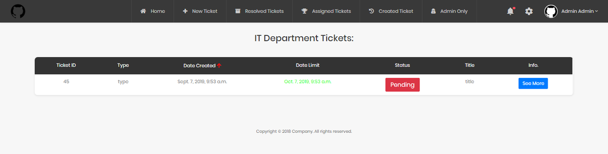

# Company Tickets




This is DJANGO project for support tickets inside a company .

## 🏁 Getting Started

These instructions will get you a copy of the project up and running on your local machine for development and testing purposes.

### Prerequisites

```
django "2.0.13" & python "3.7"
```

### Installing

Steps:

```
Clone/ Download the repository
```
run this command to instal the required packages:

```
pip install -r requirements.txt
```
add the DB:

```
DBname: "ticketdb" 
```
run the project:

```
python manage.py runserver
```
login as admin:

```
admin / admin_1234
```

## Built With

* [Django](https://www.djangoproject.com/) - The Web framework used.

## Authors

* **Skender Lahdhiri** - *Initial work* - [Skenderl](https://github.com/skenderl)

## License

This project is licensed under the MIT License - see the [LICENSE.md](LICENSE.md) file for details